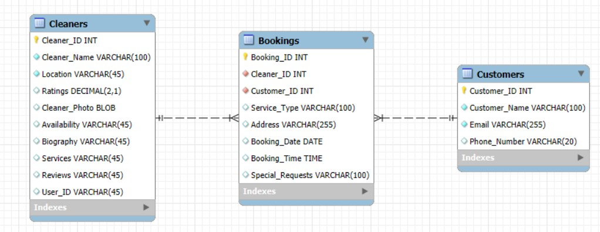
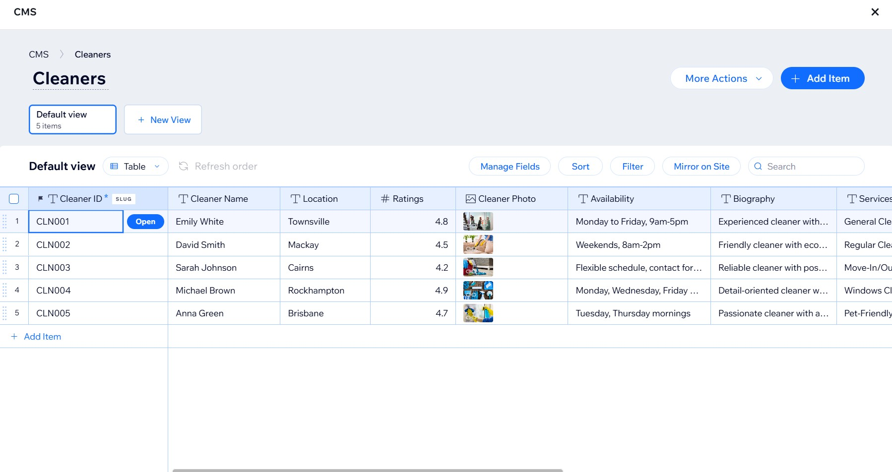
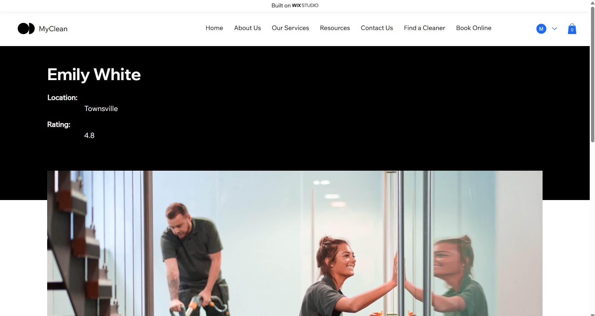

# Design
For our project, we used Wix Studio to develop the website. Wix offers a user-friendly drag-and-drop interface with a 
wide range of built-in tools that allowed us to implement the necessary features for our website without the need to 
write custom code. This made the development process faster and more efficient, as Wix provided the necessary 
architecture, database management, and user interface features straight out-of-the-box.

## Architectural Design:
As our solution leverages Wix Studio, there was no need to create a custom architectural design using UML diagrams. 
Wix Studio provides a pre-structured, cloud-based architecture that handles all the back-end infrastructure, 
including hosting, data storage, and security. The focus of my design was on configuring and customizing Wix's 
built-in tools rather than building an architecture from scratch. Wix handles the underlying components like 
database integration and server management, ensuring high availability and scalability.

Since Wix Studio was the chosen platform for this project, creating the UML diagram was unnecessary. The reason for this 
is that Wix abstracts away many of the architectural and backend components, eliminating the need to design them manually. 
While UML diagrams are commonly used for custom code solutions to illustrate object models, class interactions, or workflows, 
Wix’s platform already encapsulates these aspects, allowing us to focus solely on configuring and customizing the content and interface.

In a more code-heavy project, UML diagrams would certainly be important to depict how different components interact. 
However, in this case, the lack of custom code and reliance on Wix's built-in features negated the need for an architectural UML diagram.

## Database Design:
For the database design, we initially used MySQL to carefully plan and structure the data relationships required for the system. 
MySQL provided a clear framework for organizing entities and defining how data should be related, normalized, and 
maintained for consistency. This structured design helped guide the eventual setup within the Wix platform, 
even though Wix internally handles much of the database management through its own Content Manager system.

During the design phase, we created entity tables and defined their relationships using MySQL. Key tables include:  
The Cleaners' Table (which would store details about each cleaner, such as their ID, name, location, and more).  
The Bookings' Table (which would store details about each booking, such as the booking ID, date, time, and more).  
The Customers' Table (which would store details about each customer, such as their ID, name, email, and phone number).

Once the design was finalized, the Wix Content Manager was used to implement the structure in a no-code environment. 
Unfortunately, the only collection we were able to create in Wix (due to time constraints) was "The Cleaners' Collection". 
However, dynamic pages were still linked to The Cleaners' Collection so that the dynamic pages would automatically 
display the information (based on the data inside the database).

By designing the structure with MySQL first, we were able to clearly understand and plan for how the database should operate, 
even though the final implementation was adapted into Wix’s collection-based system without needing direct SQL commands.

This two-step approach (MySQL into Wix) ensured both technical precision in design and ease of use for web development.

## Interface Design:
For the interface design, we followed a two-stage approach to ensure both planning and effective user experience development.

The first stage was using NinjaMock, a professional prototyping tool, to draft the user interface layouts before building 
anything on the live website. This allowed for rapid wireframes and early validation of design ideas without any coding.

Using NinjaMock, we created detailed mockups for the core pages and user stories. Key user stories include:  
[Create Cleaner Profile (as an Individual Cleaner)](./user_stories/user_story_11.md).  
[Create Company Profile (as a Cleaning Business)](./user_stories/user_story_01.md).  
[Create an Account (as a Customer)](./user_stories/user_story_21.md).  
[View Cleaner Profiles (as a Customer)](./user_stories/user_story_23.md).  
[Receive Booking Requests (as a Cleaning Business)](./user_stories/user_story_05.md).

The second stage, after finalizing the design blueprints in NinjaMock, was using Wix Studio's built-in design tools to 
develop the real interface based on the wireframes. This allowed for design consistency across all pages of the website.

By using NinjaMock first for conceptual design, and then Wix Studio for practical implementation, we ensured that the 
final user interface was both user-friendly and visually aligned with our initial design goals.
