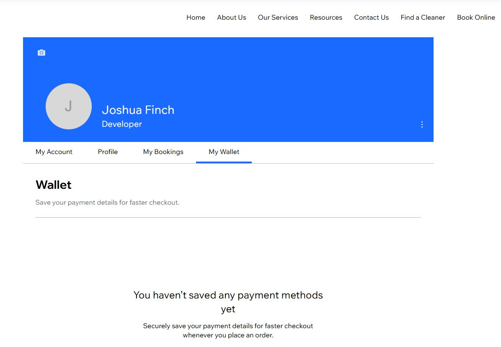

# Implementation

Due to a large number of unfortunate events, the production of the website (and its documentation) has been severely limited (compared to what it was initially planned as).

## Iteration 1:

- Team Starting Status: 4 active members
- Then: 2 active members (1 member quit due to floods, and 1 member ghosted the team multiple times)
- Then: 1 active member (the other member was hospitalised for multiple weeks and had to take mind-altering medicine)

### Needed:

In Iteration 1, it was planned for the team to complete a total of 9 user stories (11, 01, 21, 23, 12, 05, 24, 13, and 22). 
It was calculated that each team member would do roughly three stories each. Due to the lack of activity from most of the team, 
only three user stories were completed by Joshua Finch "JF" (11, 01, and 21). Further effort by JF was not attempted due to 
other unrelated tasks (assignments) and personal problems that affected motivation (death and funeral of a grandparent).

### On Time:

Aside from the unfinished user stories, the ones assigned to JF were all completed on time for an extended due date of Iteration 1.

### On Budget:

The budget for this Iteration (and the project as a whole) was set at $0.00. This limitation was kept in Iteration 1 
through the use of free tools, and the developers not getting paid (due to it being a university assignment).

### Client Feedback

Unhappy about the lack of agreed upon progress, but understanding of the difficulties the team was facing. Due to the 
low chance that the project will catch up to the prior expected pace under the current team, no more Iterations will be 
authorised beyond what is already planned (Iteration 2). The project will likely be either used as a test and discontinued, 
or used as a bumping-off point for a later team.

## Iteration 2: 

- Team Starting Status: 2 active members (1 member with little time due to catching up on multiple subjects)
- The velocity significantly decreased due to the low throughput in Iteration 1.
- With multiple assignments due and a lot of catching up to do, it was not expected to be greatly surpassed.

### Needed:

For Iteration 2, it was planned for the team to finish two of the highest priority user stories (23, 5) that fit into the 
revised iteration plan. Those being; the ability for members to search for cleaners from a database; and the ability for 
members to book a session from said cleaners. Due to the nature of the free version of Wix Studio, and the expected low 
amounts of attention able to be directed towards this project, the team could only guarantee that these two user stories 
would be completed (as they were larger in scope than the user stories completed in Iteration 1). Any further available 
time would be spent on attempting to complete the remaining user stories that would have been completed in Iteration 1.

### On Time:

Due to further complications, other unfinished critical tasks went over their allotted time budget. Even though both of 
the planned user stories were completed, they required a significant extension to the due date. 
Nevertheless, the project is on track to be submitted before the final deadline: quote "before the exam" unquote. 

### On Budget:

Just as it was the same as in Iteration 1, the budget for this Iteration (and the project as a whole) was set at $0.00. 
This limitation was kept in Iteration 2 through the use of free tools, and the developers not getting paid (due to it being a university assignment).

### Client Feedback

The further delays are definitely not helping, but the client is satisfied that the agreed upon revisions to the 
expected user stories have been completed and that the teams' velocity has not lowered yet again.

## UI, Database and Deployment Choice

To properly display the UI and the database, various images from the website have been taken.

### UI
Showing: the Home Page; Team Members; Specific Cleaner's Details (bottom of page); Member's Profile; Searching Cleaners; and Specific Cleaner's Details (top of page).

### Database
Showing: the frontend and the backend of the website's database.

### Deployment Choice
Due to the use of Wix Studio, it handles all the hosting and deployment for us. 

