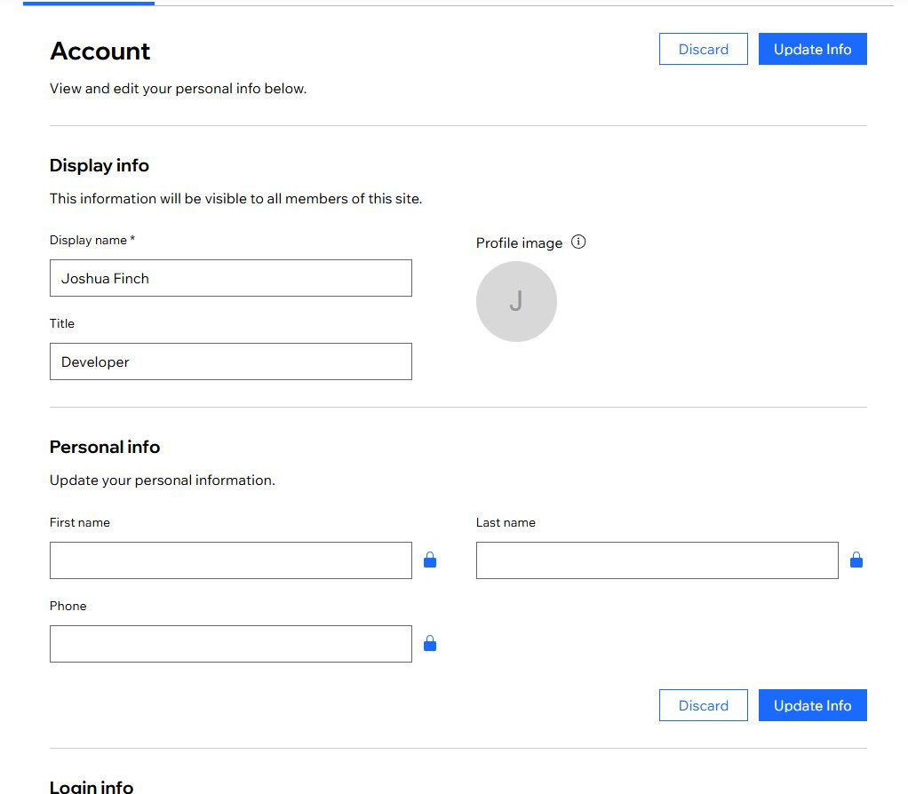
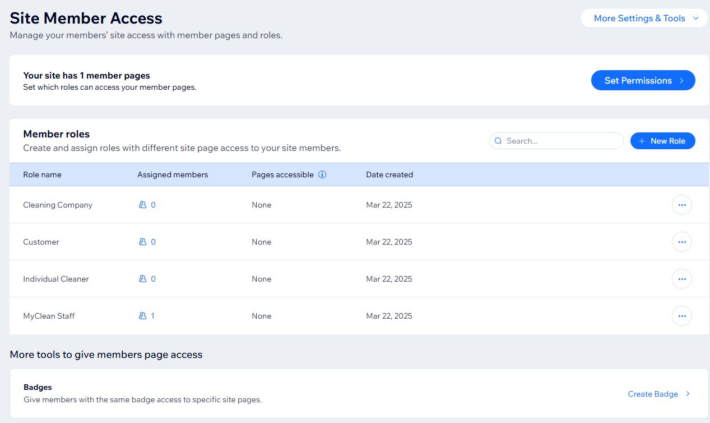

# Page is for showing proof of tests for each completed user story 

## Iteration 1:

- User Story 11: Create an Account - as a Customer

Implemented solution does not use developer written code, but instead uses a standard, free Wix module. Proof is in the
form of two screenshots: the first being the view that a new user would see attempting to sign in, while the second is 
of a user signed in.

- User Story 1: Create Company Profile - as a Cleaning Business

Implemented solution does not use developer written code, but instead uses a standard, free Wix module. Proof is in the
form of two screenshots: the first being the view of the user's account that a new business would see when newly signed in for the first time,
while the second is of an empty (un-customised) business' profile.

- User Story 21: Create Cleaner Profile - as an Individual Cleaner

Implemented solution does not use developer written code, but instead uses a standard, free Wix module. Proof is in the
form of two screenshots: the first being the view of the user's account that a new cleaner would see when newly signed in for the first time,
while the second is of an empty (un-customised) cleaner's profile.

## Iteration 2:

- User Story 23: View Cleaner Profiles - as a Customer

Initial method used to make Profiles in Iterations 1 (User stories 1 and 21) were found to be un-editable due to Wix paywalls. 
New implemented solution uses Wix's in-built database creation and management tools instead of code or the Wix module to 
make and show the database, but leaves the Wix profile and login Module in place to potentially improve upon in the future
pending use of paid features. Proof of completion is two screenshots showing the back-end database and the front-end
page visible to users.

- User Story 5: Receive Booking Requests - as a Cleaning Business

User story was not well put together due to the fact that: A) to recieve booking requests, the entire booking system is needed to be implemented B) the implemented solution for User Story 23 could not easily be integrated with the Wix Studio Booking process and C) the free version of Wix Studio prevents online booking from being functional, leaving only backend (the services listed) and the frontend service selection screen visible. The first image is of the frontend service selection while the second is of the backend where the MyClean staff would add more and edit existing services of partnered cleaners.

