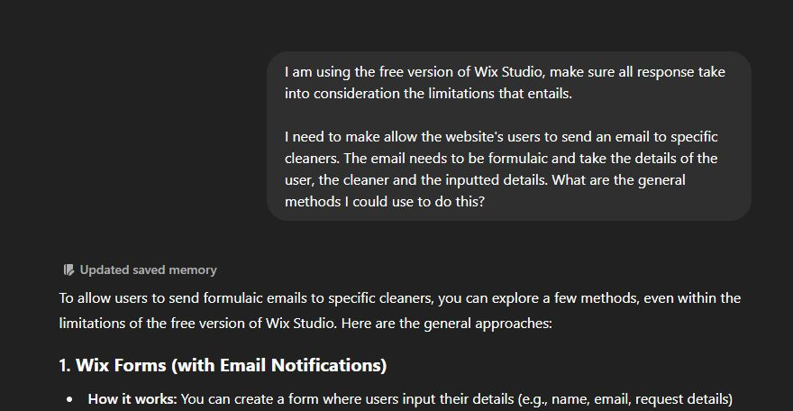

# Tools Used for the Completion of this Assignment

## Wix Studio
To create the website for this assignment, our team chose to use the Wix Studio IDE instead of competitors such as the regular Wix Editor, Squarespace and Weebly due to the fact that it offered the ability to create websites
without the need to code and the fact that it had a widely recommended free version that allowed multiple people to work on the same project/website without requiring extensive setup or an increase in cost.

Unfortunately, what was not advertised about Wix Studio is that while it allows developers to create using the official Components and Features of the IDE. It does not allow customisation or even full functionality for certain
pieces that are critical to the use of a website. For our team specifically, it caused:

- The profile pages that are created during the sign-up of new members to not be able to be customised by members (or developers) or have forms added that would allow for further functionality. This caused work in iteration one
to be effectively wasted effort without spending money to unlock those features.

- The members' database from the initial signup was unable to be modified to also be used for other functions that were critical to the website's functions.

- The booking component was able to be implemented and allowed backend use (modifying lists of services) and frontend viewing of said services for users but didn't allow for them to be used for online booking.

Due to time, fiscal and personnel constraints, these problems were not able to be surmounted either through switching to a different IDE, paying the fee or through coding and testing of that code ourselves.

## GitHub
GitHub was used due to the specified assignment requirements for a file sharing platform to hold all of our projects documentation history. Throughout the assignment, all active team members (Martin and Joshua) have made extensive use of this tool.

## GitHub Projects
During this assignment, there was a need for team members to easily find out which team member was assigned to what task/user-story and where that task was at. Due to the required use of GitHub as a documentation repository, 
it was decided that the team would use GitHub Projects for this role instead of another popular tool, Jira due to the ability to tie both GitHub and Projects together. Both team members successfully used this function to 
keep track of all user stories that were completed.

## Discord
Due to the personal preferences of all the developer team members, the communications method was unanimously chosen to be Discord over alternatives such as Slack. This allowed all members to easily share information on
their progress and any potential issues they encountered. 

## PyCharm
While some actions (such as adding images to .md files) were easier to perform through GitHub directly. The majority of the work on the project's documentation was performed using PyCharm to host local versions of the 
project. This allowed for members to avoid potentially overwriting another member's commits. PyCharm was chosen over Visual Studio Code due to both team preferences and recommendations from lecturers.

## ChatGPT
ChatGPT was used to support the developers in:

- Comparing popular IDEs to help decide which IDE to use to construct the website and
- Aiding developers to learn how to use the chosen IDE (Wix Studio) by outlining what was possible (NOTE: It took a lot of effort to refine queries that remembered that the free version of Wix Studio couldn't do certain
things).

- Example:

## MySQL & NinjaMock
These two programs were utilised to provide proof of database and interface design elements used in the project's development. 

NinjaMock was used to prototype wireframes before the ideas were implemented in the IDE. It was used primarily 
(but not entirely) by team member Joshua Finch. 

MySQL was used specifically to show how the website utilised databases. It was used by team member Martin Armstrong due 
to his familiarity with the website's database. While GenMyModel (a tool for database design) was recommended to be used, 
it was found to no longer be available and was thus replaced with MySQL.
