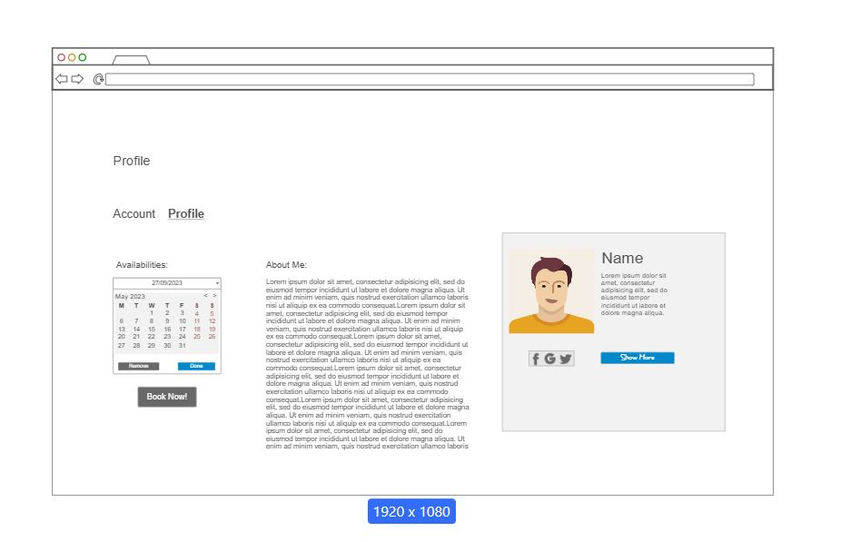

# User story title: Create Company Profile (as a Cleaning Business)
No previous versions

## Priority: 20 (Project planning BEFORE iteration-1)
No changes yet

## Estimation: 4 days (2 days * 2)
* Alex (has since left the project): 2 days (estimated before iteration-1)
* Joshua: 1 day (estimated before iteration-1)
* Martin: 2 days (estimated before iteration-1)

Initial Estimation: 2 days (estimated before iteration-1)  
Current Estimation: 4 days (estimated after removing assumptions before iteration-1)

## Assumptions (if any):
* Initial estimation was based on days with 2 working developers at the same time (rather than for each working developer)

## Description: As a cleaning business, I want to create a company profile so that I can showcase my services and attract customers.
Description-v1: As a cleaning business, I want to create a company profile so that I can showcase my services and attract customers.

## Tasks, see chapter 4.
Task 1: Defunct/Folded into User Story 11 - the basic Wix login module doesn't allow multiple types of user accounts, only different permissions on page viewing. Changing that either needs payment or custom code that means throwing out ther currently uneditable Wix provided module. Essentially, Buisiness accounts will simply be mechanically the same as regular cleaner accounts, just with different content (links to affiliated cleaners). Estimation 2 days.

## UI Design:

## Completed:
MERGED WITH USER STORY 11 - IS DEFUNCT
