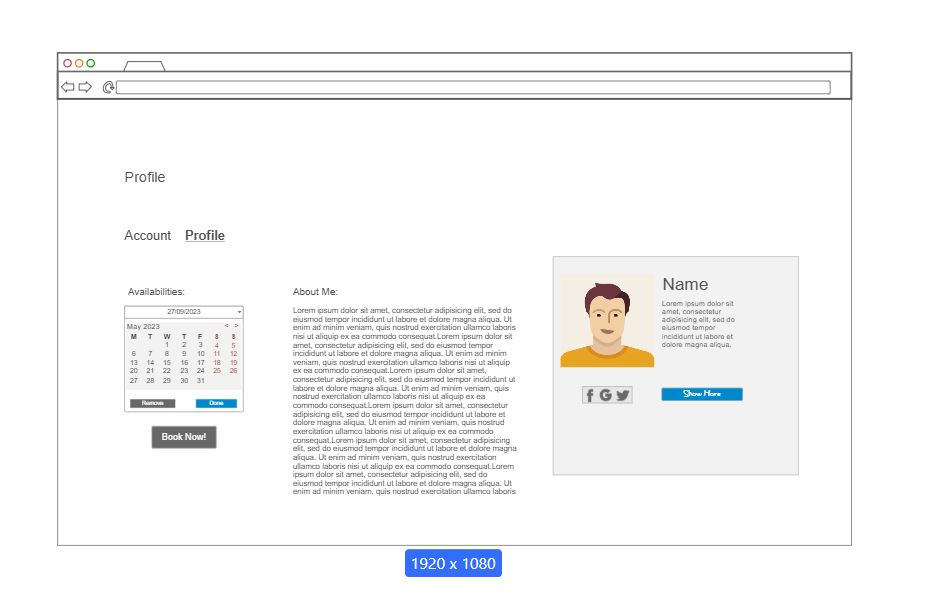

# User story title: Create Cleaner Profile (as an Individual Cleaner)
No previous versions

## Priority: 10 (Project planning BEFORE iteration-1)
No changes yet

## Estimation: 3 days (1.5 days * 2)
* Joshua: 1 day (estimated before iteration-1)
* Martin: 2 days (estimated before iteration-1)

Initial Estimation: 1.5 days (estimated before iteration-1)  
Current Estimation: 3 days (estimated after removing assumptions before iteration-1)

## Assumptions (if any):
* Initial estimation was based on days with 2 working developers at the same time (rather than for each working developer)

## Description: As an individual cleaner, I want to create a personal profile with my skills, experience, and pricing so that customers can book my services.
Description-v1: As an individual cleaner, I want to create a personal profile with my skills, experience, and pricing so that customers can book my services.

## Tasks, see chapter 4.
Task 1: Implement a basic and user-specific, customisable profile page gated behind a user logging in. Estimation = 1 day.  
Task 2: (Links to later user stories) Add specific sections that are only visible for other users if they are registered as specific member types. Estimation = 1 day.

## UI Design:

## Completed:

