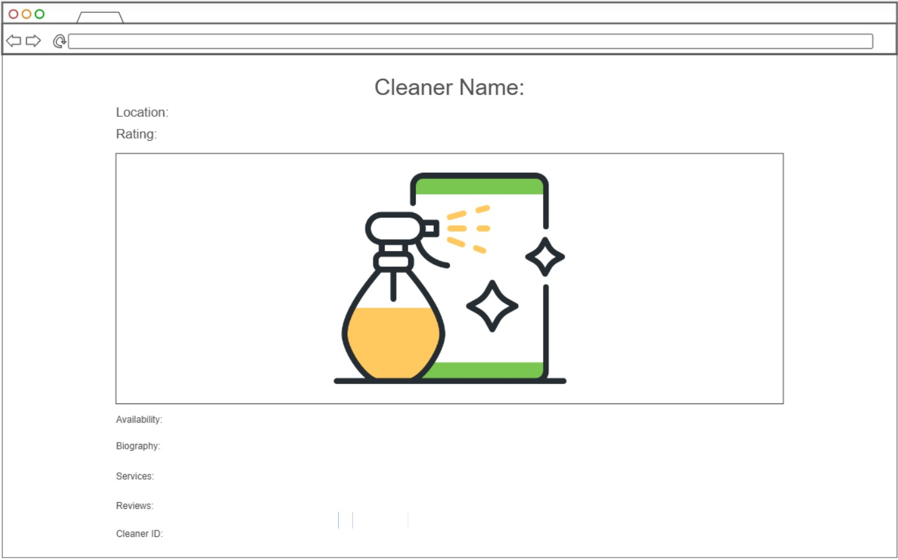
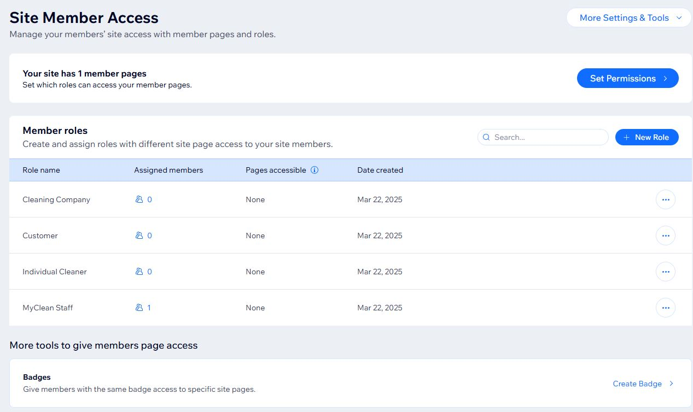
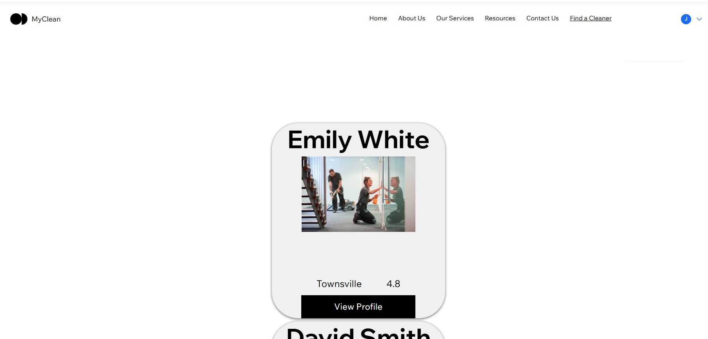
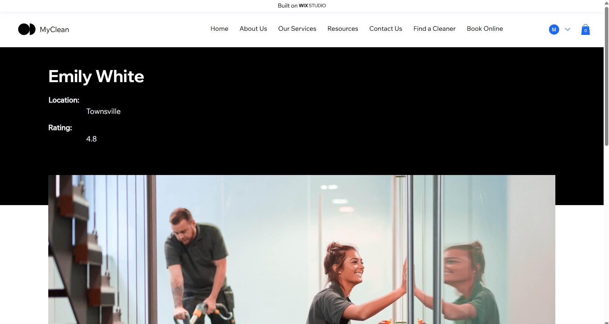

# User story title: View Cleaner Profiles (as a Customer)
No previous versions

## Priority: 10 (Project planning BEFORE iteration-1)
No changes yet

## Estimation: 4 days (2 days * 2)
* Martin: 3 days (estimated before iteration-1)
* Joshua: 1 day (estimated before iteration-1)

Initial Estimation: 2 days (estimated before iteration-1)  
Current Estimation: 4 days (estimated after removing assumptions before iteration-1)

## Assumptions (if any):
* Initial estimation was based on days with 2 working developers at the same time (rather than for each working developer)

## Description: As a customer, I want to view cleaner profiles with ratings and reviews so that I can make an informed decision before booking.
Description-v1: As a customer, I want to view cleaner profiles with ratings and reviews so that I can make an informed decision before booking.

## Tasks, see chapter 4.
Task 1: Create a Database Collection and add relevant fields such as;
Cleaner ID, Cleaner Name, Location, Ratings, Cleaner Photo, Availability, Biography, Services, Reviews, and User ID. Estimation = 1 day.  
Task 2: Create a Dynamic Page and link it to the Database Collection. Estimation = 1 day.  
Task 3: Design the Dynamic Page and use in-built elements. Estimation = 1 day.  
Task 4: Add a Cleaner Directory Page and use a repeater or gallery element. Estimation = 1 day.  
Note: The free version of Wix Studio does not allow users to utilize the details in their personal profiles as database entries.

## UI Design:

## Completed:

